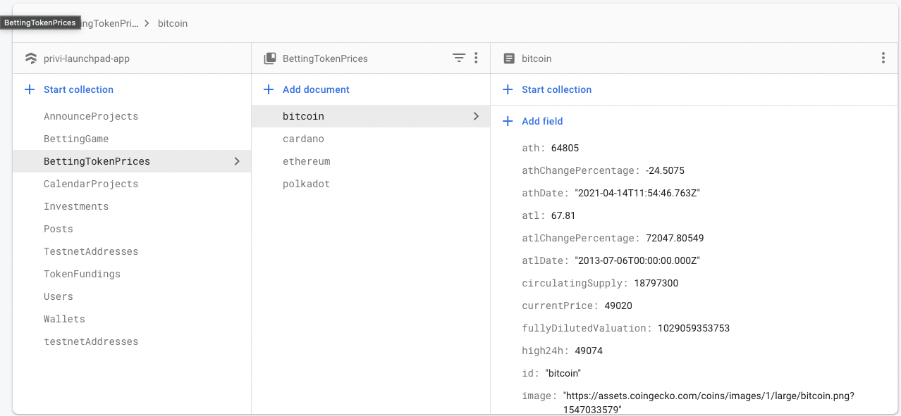

# Price feed microservice

## How this works

This microservice runs a cron job in every 5 seconds to get the price data using Coingecko API. After that, those informations are persisted to the Firestore. The service also provides an endpoint to get the feed data from Firestore

## Documentation

### Authentication

This endpoint uses the basic authentication method. There is a predefined API key (`BASIC_REQUEST_TOKEN`). The client should send this key in the authorization header with `Basic` key prefix.

```bash
Authorization: Basic "BASIC_REQUEST_TOKEN"
```

### Get price feed

| Type | `GET` request |  |
| --- | --- | --- |
| URL | `/feed` |  |
| QueryParams | `tokens` : string[] | Optional. This can be an array of token id that you'd like to get price updates on. If omitted, it will send the entire list of token prices. token ids for each token can be referenced here (https://docs.google.com/spreadsheets/d/1wTTuxXt8n9q7C4NDXqQpI3wpKu1_5bGVmP9Xz0XGSyU/edit#gid=0) |
| Response type: | `response`: [CoinMarketInfo](./src/common/types.ts)[] |  |
| Example: | http://localhost:3000/feed?tokenIds[]=bitcoin&tokenIds[]=cardano |  |

Example response:

```json
[
  {
    "priceChangePercentage7dInCurrency": 0.9812720397514775,
    "priceChangePercentage24hInCurrency": 0.050564540128427565,
    "athChangePercentage": -27.16189,
    "high24h": 47774,
    "totalVolume": 31375813486,
    "priceChangePercentage24h": 0.05056,
    "priceChange24h": 23.86,
    "image": "https://assets.coingecko.com/coins/images/1/large/bitcoin.png?1547033579",
    "totalSupply": 21000000,
    "id": "bitcoin",
    "currentPrice": 47204,
    "atlChangePercentage": 69511.01633,
    "symbol": "btc",
    "atl": 67.81,
    "marketCap": 887381648924,
    "priceChangePercentage1hInCurrency": -0.3542767542825147,
    "atlDate": "2013-07-06T00:00:00.000Z",
    "marketCapRank": 1,
    "low24h": 46451,
    "athDate": "2021-04-14T11:54:46.763Z",
    "fullyDilutedValuation": 991278228063,
    "lastUpdated": "2021-08-27T13:48:18.368Z",
    "marketCapChange24h": 2139980147,
    "ath": 64805,
    "circulatingSupply": 18798975,
    "name": "Bitcoin",
    "roi": null,
    "marketCapChangePercentage24h": 0.24174,
    "maxSupply": 21000000
  },
  {
    "image": "https://assets.coingecko.com/coins/images/975/large/cardano.png?1547034860",
    "atl": 0.01925275,
    "marketCapChange24h": 4715376917,
    "athChangePercentage": -7.61047,
    "priceChangePercentage1hInCurrency": 0.6587101305391184,
    "marketCapRank": 3,
    "marketCapChangePercentage24h": 5.69977,
    "ath": 2.95,
    "priceChangePercentage7dInCurrency": 19.528432824060065,
    "atlChangePercentage": 14064.05012,
    "totalSupply": 45000000000,
    "lastUpdated": "2021-08-27T13:48:12.208Z",
    "currentPrice": 2.74,
    "low24h": 2.49,
    "high24h": 2.74,
    "fullyDilutedValuation": 122714325052,
    "name": "Cardano",
    "priceChange24h": 0.143619,
    "circulatingSupply": 32066390668.4135,
    "roi": null,
    "marketCap": 87444566394,
    "athDate": "2021-08-23T23:04:47.623Z",
    "maxSupply": 45000000000,
    "id": "cardano",
    "symbol": "ada",
    "atlDate": "2020-03-13T02:22:55.044Z",
    "priceChangePercentage24h": 5.5312,
    "priceChangePercentage24hInCurrency": 5.531198360877481,
    "totalVolume": 5683714467
  }
]
```

### Get NFT sale price

| Type | `GET` request |  |
| --- | --- | --- |
| URL | `/nft-sale` |  |
| QueryParams | `contract` : string | Required. This is the address of the NFT (ERC721 variant) contract |
|  | `tokenId` : string | Required. This is the token id of the NFT |
| Response type: | `response`: { price: string } |  |
| Example: | http://localhost:3000/nft-sale?contract=0x9d418c2cae665d877f909a725402ebd3a0742844&tokenId=3955 | Get the last sale price of the [NFT](https://etherscan.io/token/0x9d418c2cae665d877f909a725402ebd3a0742844?a=3954) |
|  | Response: `{ "price": "0.3999" }` |  |

## Database

The coin price data is saved to `BettingTokenPrices` collection



## Prerequisites

- [NVM](https://github.com/nvm-sh/nvm#installing-and-updating)

## Setup

```bash
$ nvm install
$ npm install
$ cp .env.example .env
```

## Development

```bash
$ npm run start:dev
```
